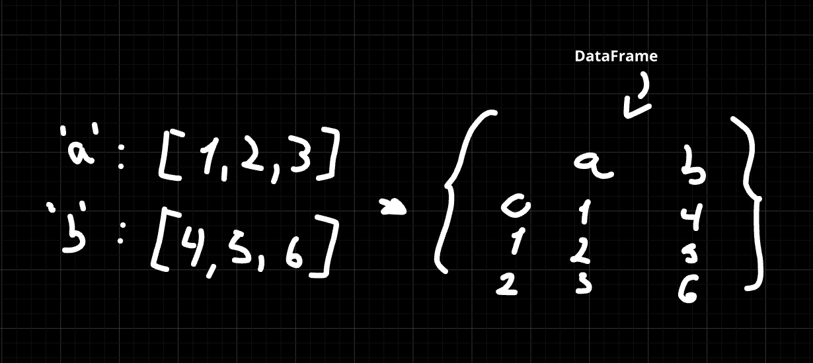

# What is Pandas?

Pandas is a Python library used for working with data sets.

It has functions for analyzing, cleaning, exploring, and manipulating data.

The name "Pandas" has a reference to both "Panel Data", and "Python Data Analysis".

## Series

A Pandas Series is like a column in a table.

It's a one-dimensional array holding data of any type.

## DataFrames
Data sets in Pandas are usually multi-dimensional tables, called DataFrames.

Series is like a column, a DataFrame is the whole table.

## Data purification:
Data cleaning is the process of eliminating or changing any information in our dataset that is duplicated, incorrectly formatted, null, or even an inaccurate record.

There are several approaches to addressing these issues:

You can eliminate null records, change a certain column to date format, eliminate duplicate entries, and swap out a particular record for another by using the `.dropna()`, `.fillna()`, `.to_datetime()`, and `.drop_duplicates()` methods.
