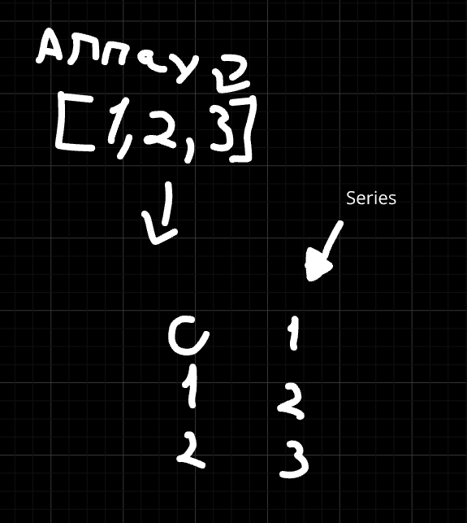

# What is Pandas?

Pandas is a Python library used for working with data sets.

It has functions for analyzing, cleaning, exploring, and manipulating data.

The name "Pandas" has a reference to both "Panel Data", and "Python Data Analysis".

## Series

A Pandas Series is like a column in a table.

It's a one-dimensional array holding data of any type.

## DataFrames
Data sets in Pandas are usually multi-dimensional tables, called DataFrames.

Series is like a column, a DataFrame is the whole table.

